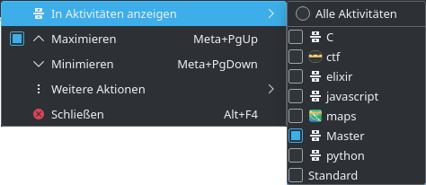
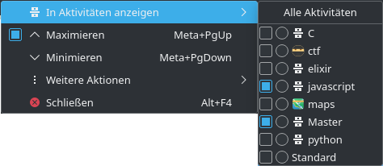

# kde enhancement proposal for assigning windows to one and only one activity
I want to propose to enhance the way that windows can be assigned to kde activities.

At the moment a window can be assigned to multiple activities.
For the case that a window should be assigned to one and only one activity, the user has to
1. open the menu
2. select the activity the window should be assigned to (checkbox)
(now the window is assigned to two activities)
3. * open the menu again
4. * unselect the current (unwanted) activity

I propose to, additional to the checkboxes, add some radio buttons.
Radio buttons imply that they don't allow multiple selections, but just one and only one.

Now, to assign a window to only one activity, the user has to
1. open the menu
2. select the activity the window should be assigned to (radio button)

---
(The term "Master" in the screenshots refer to the university degree I want to archive. For general activities, I use the activity "Standard")
